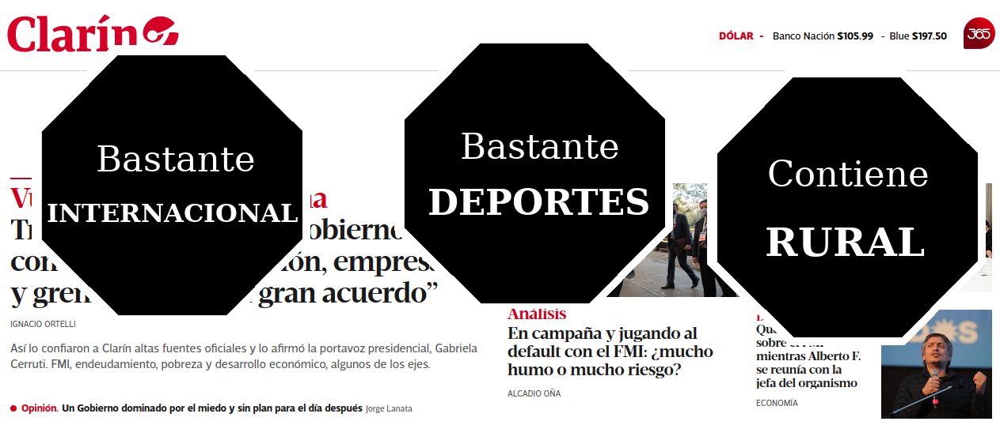
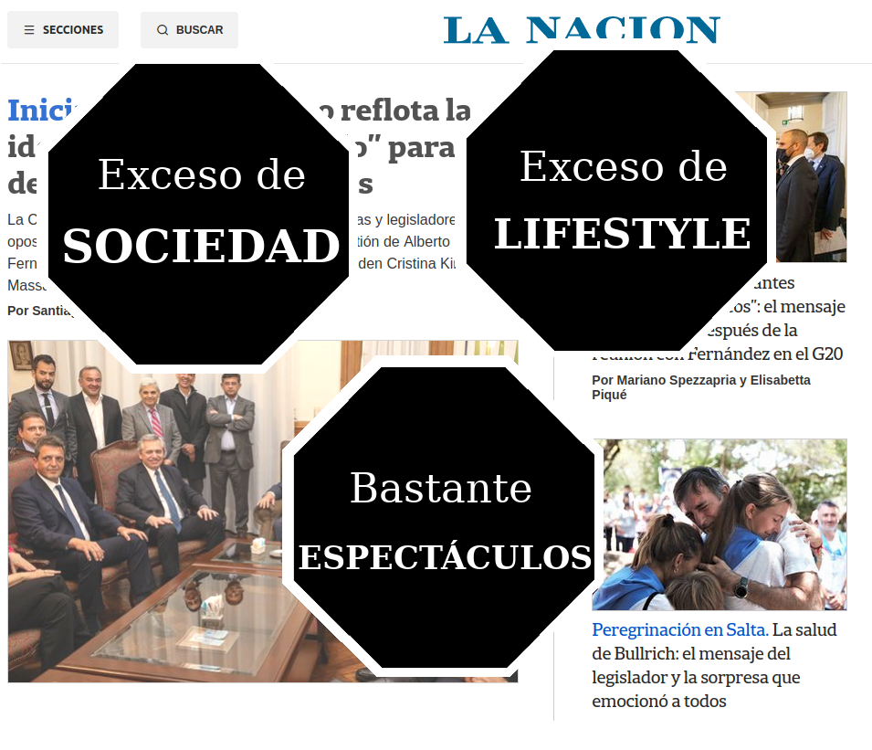
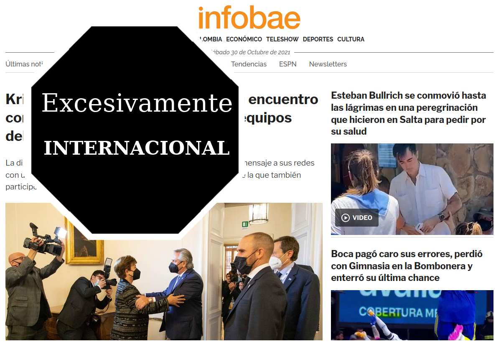
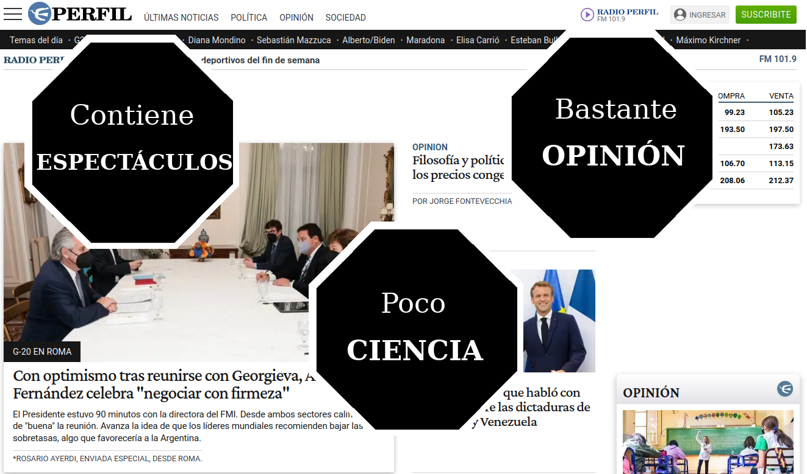
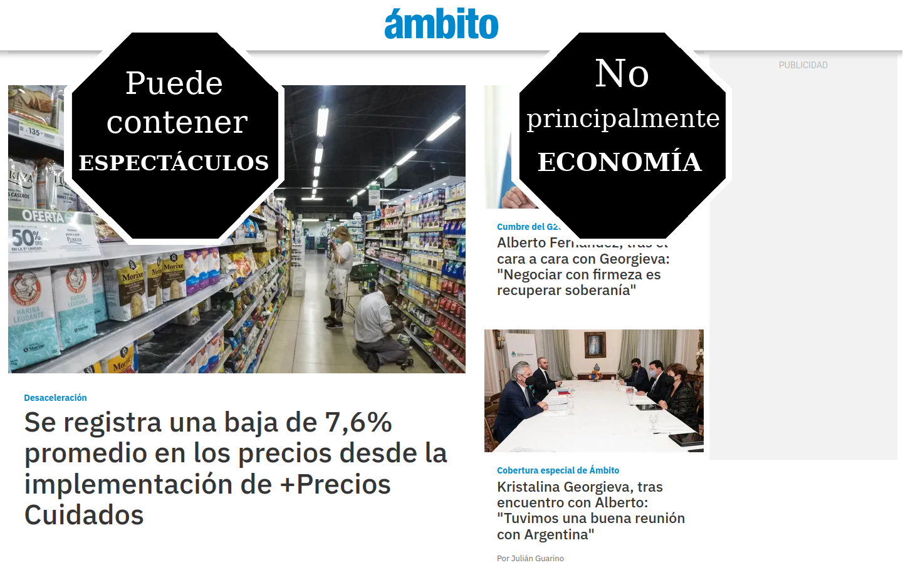
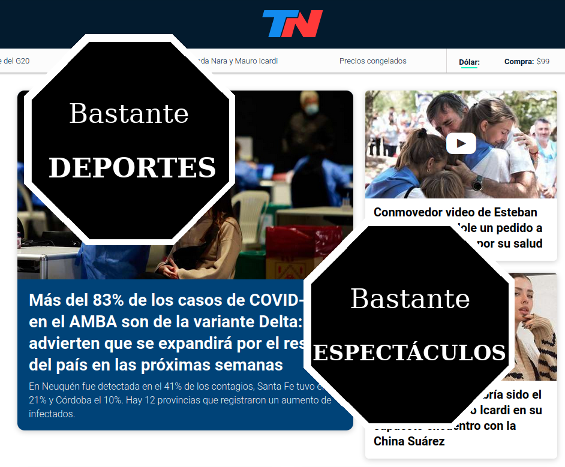

## A TENER EN CUENTA:
- cada **tweet** es un tweet del hilo: **tweet 1** = primer tweet del hilo, **tweet 2** = segundo tweet del hilo, etc etc, **tweet 11** = último tweet del hilo.
- copiar y pegar el texto TAL CUAL: está chequeado que cumple con el largo de 280 caracteres y que se ven bien las @menciones y los #hashtags.
- las imagenes son para agregar en cada tweet. Los  que no tienen imagen son sólo texto (1, 2, 3 y 11).

## tweet 1:
📰🏷️LEY DE ETIQUETADO FRONTAL DE MEDIOS: @clarincom @LANACION @infobae @Ambitocom @pagina12 @todonoticias. Tomando como disparador la #LeyDeEtiquetadoFrontal de alimentos, desarrollamos este análisis que comparte la esencia: alertar sobre contenido no deseado en productos. 1/11

## tweet 2:
Usamos todas las noticias de Septiembre 2021 de cada portal web para armar un ranking de 'secciones con más noticias' para cada diario. Por ejemplos: @clarincom publicó en Septiembre 1180 noticias de #política, 1039 de #internacional y 908 de #deportes. Ese fue su top 3. 2/11

## tweet 3:
La idea es que la próxima vez que vayas a buscar info a estos portales web, sepas más detalladamente con qué te vas a encontrar (y con qué no). Empezamos: 3/11

## tweet 4:

El gran diario argentino @clarincom tiene a #política como su sección principal, pero en el podio también entran #internacional y #deportes. Detalle a destacar, tiene una sección llamada #rural con varias noticias. 4/11

## tweet 5:

Lo de @lanacion es un caso particular. Nació como una 'tribuna de doctrina', y hoy su top 3 es #sociedad, #lifestyle y #espectáculos. Casi que es una magazine de #actualidad. Ojo cuando vayan a buscar data ahí y terminen leyendo sobre qué ropa prefieren las celebridades. 5/11

## tweet 6:

@infobae contiene un ALTÍSIMO NIVEL de noticias de #internacional: noticias de #méxico, #chile, #colombia, #eeuu y -sobretodo- #venezuela. En números: durante Septiembre tuvo 50mil de noticias de #internacional, contra 800 noticias de #política, la segunda sección. 6/11

## tweet 7:

@perfil tiene un podio más tradi: #política, #economía y #deportes. En el cuarto lugar viene #espectáculos y en el quinto #opinión: es el medio que más 'opiniones' publica. Últimos en el ranking aparecen las secciones #tecnología y #ciencia. 7/11

## tweet 8:

@ambito es un diario económico/financiero -su nombre 'Ámbito financiero' bien lo indica-. Pero en su top 3 aparecen #política, #sociedad y #economia. Ni #economia es su sección principal, ni #finanzas, que existe y aparece en el puesto 5 de secciones con más noticias. 8/11

## tweet 9:

@paginadoce es un poco #rosariocéntrico: su tercera sección con más noticias es #rosario12. Las primeras dos secciones con más noticias son #política y #sociedad. Es uno de los medios que menos noticia de #cultura publica. 9/11

## tweet 10:

@tn tiene un top 3 de estilo parecido al de @lanacion: #política, #deportes y #espectáculos. Aconsejamos NO buscar info sobre #economía en este portal: publica más noticias de #música y de #estilo que de #economía. 10/11

## tweet 11:
©️ desarrollo hecho por el Labo de datos de  @Elateneoac 🤖. Versión web🌐: https://www.shorturl.at/cgCF3; más proyectos: https://elateneo.org.ar/ + https://github.com/elateneoac. 11/11 🔚

